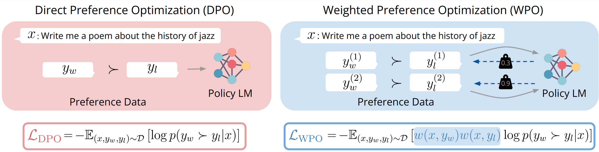

# Weighted Preference Optimization (WPO)
This repository contains the code and released models for our paper "WPO: Enhancing RLHF with Weighted Preference Optimization". We propose a novel strategy to enhance off-policy preference optimization by simulating on-policy learning with off-policy preference data. Our Weighted Preference Optimization (WPO) method adapts off-policy data to resemble on-policy data more closely by reweighting preference pairs according to their probability under the current policy. This method not only addresses the distributional gap problem but also enhances the optimization process without incurring additional costs. WPO not only outperforms Direct Preference Optimization (DPO) by up to 5.6\% on Alpaca Eval 2 but also establishes a remarkable length-controlled winning rate against GPT-4-turbo of 48.6\% based on Llama-3-8B-Instruct, making it the strongest 8B model on the leaderboard to date.

</img>

## Release
- **[6/17]** We released our preprint. We are still awaiting internal approval for releasing the code and models. Stay tuned for updates.

## Models
### v1 models
The table below presents our trained models in the paper along with their evaluation results. Please note that these results differ from those reported in the paper, as the paper provides average results, whereas the results below pertain to individual checkpoints.
| Checkpoint | Alpaca Eval LC | Alpaca Eval WR |
|---|---|---|
|[zephyr-7B-WPO-FP](https://huggingface.co/wzhouad/zephyr-7B-WPO-FP)|25.4|21.0|
|[zephyr-7B-WPO-HB](https://huggingface.co/wzhouad/zephyr-7B-WPO-HB)|49.8|42.9|
|[Llama3-Instruct-8B-WPO-FP](https://huggingface.co/wzhouad/Llama3-Instruct-8B-WPO-FP)|31.5|33.8|
|[Llama3-Instruct-8B-WPO-HB](https://huggingface.co/wzhouad/Llama3-Instruct-8B-WPO-HB)|48.3|52.3|
